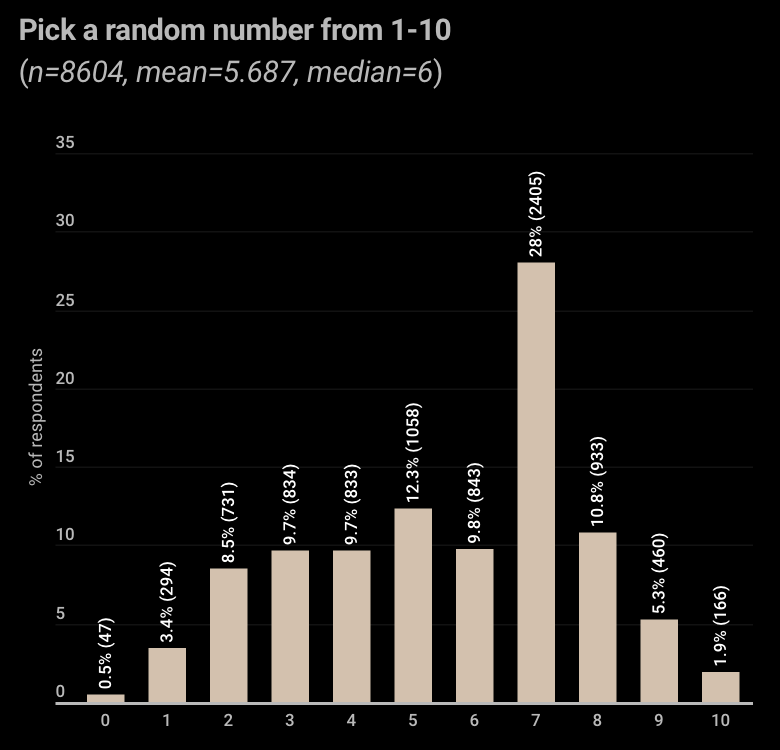

---
tags:
  - encryption
  - otp
---

# Introduction

One time pad is a theoretically unbreakable encryption method that requires sender and receiver to possess the same identical key-data. It is ideal for field use where humans will be manually encrypting/decrypting messages. A sender / receiver pair is called a 'channel', and is practically speaking one-way, so if you need two-way comms then you'll have two channels — two pads — between the sender and receiver. The reason for keeping a channel one-way is simple: if both parties sent from the same pad, they could each grab the same next unused page at the same time and encrypt two different messages with it. That is an accidental two-time pad, and as you will see below, it is fatal. One direction per pad makes that mistake structurally impossible, and it also removes any confusion about which page comes next.

The name is quite descriptive of how the scheme works. In a single channel you have two pads, A and B, which are identical. Each pad has a certain number of pages, and you use at least one page per message that you send / receive. After a page has been used to either encrypt an outgoing, or decrypt an incoming message, the page is destroyed and must absolutely never be used again.

Anyone may capture the encrypted message in transmission, but they can not decrypt it without the correct key-data (written on the page). If the page is correctly destroyed on both ends after use, then no one can ever decrypt the message again. It has simply become random noise at that point.

In order to understand OTP it is helpful to first understand the shift cipher, the scheme most people know through its most famous member, Caesar's Cipher. Strictly speaking Caesar's Cipher is the specific shift-by-three; the general family is called the shift cipher, and ROTn is the usual naming for a shift of n. A shift cipher can then be understood as a terrible implementation of OTP, where the key is a single character repeating indefinitely. Or alternatively, OTP is a shift cipher where each character has its own unique rotation, as determined by the key. More on that soon.

# Example transmission

I want to perform a basic encrypt/decrypt cycle so that we have something concrete to discuss further. Below is a tiny example page that we'll be using. Note that the spaces on this page are only there to make it readable, they are not part of the key.

```
FEKXE TQSIF CBIAH NZENE UURWQ 
```

Now we'll write a secret message: 
```
Activate Nåughtfire.
```

Before we can apply our encryption we have to sanitize the message by removing spaces, punctuation, case, and substitute weird Scandinavian letters. How we're going to substitute for å is just a matter of convention, I will simply replace with 'a', but you could replace with two a's for example, or 'au'. That is not part of the encryption scheme.

Digits are handled by convention too, and real field messages are full of them — times, grid references, counts. Our convention is to spell each digit out as a word, digit by digit: 350 becomes THREE FIVE ZERO, never THREEHUNDREDFIFTY. Digit words survive garbled transmission far better than compact notations, and a single garbled character can't silently turn one number into another. For critical figures, repeat them: MEET AT ONE FIVE ZERO ZERO REPEAT ONE FIVE ZERO ZERO. Like the å rule, this must be agreed before the first message is ever sent — sender and receiver have to sanitize identically or the receiver ends up guessing.

```
ACTIVATENAUGHTFIRE
```

Then we pad the message so that it matches the length of the key. The key length is: 5 x 5 = 25 characters.

```
ACTIVATENAUGHTFIREXXXXXXX
```

Padding the message is not a strict requirement of OTP, but I prefer to do it because it prevents metadata leakage. If we don't pad, an adversary will know the exact length of the message being sent. 
## Encryption

Now we may begin the encryption process. First of all we have to convert both the key and the message into numbers, where A = 0, B =1, and so forth:

Index (just for convenience)
```
A 00
B 01
C 02
D 03
E 04
F 05
G 06
H 07
I 08
J 09
K 10
L 11
M 12
N 13
O 14
P 15
Q 16
R 17
S 18
T 19
U 20
V 21
W 22
X 23
Y 24
Z 25
```

Key - converted to numbers
```
05 04 10 23 04 19 16 18 08 05 02 01 08 00 07 13 25 04 13 04 20 20 17 22 16 
```

Message - converted to numbers

```
00 02 19 08 21 00 19 04 13 00 20 06 07 19 05 08 17 04 23 23 23 23 23 23 23
```

We still haven't encrypted anything, we have only converted our key and our message into a format that we can do math with. Each digit pair represents a letter of the alphabet, 0-25. The encrypted output must also be in that format. 

At this point it's helpful to think of the shift cipher again. A shift cipher uses a single number 1-25 to rotate every character by the same amount. The naming scheme is ROTn: ROT3 if the shift is 3, ROT4 if 4, and so forth — Caesar's original was ROT3. We're going to do the same thing here, except each character gets its own ROTn, where n is determined by the corresponding character from the key.

The first letter of the message, A (or 00) should be "rotated" by the first letter of the key; F or 05. Doing that is easy, we just add them together and that gives us 05 (F). The second letter is also simple, we add 04 to 02 and get 06 (G). But in the third letter we need to do something, because 10 and 19 gives us 29, which isn't a valid letter.

This is where the concept of 'rotating' makes sense. Once we are at the last letter in the alphabet, Z or 25, the next one has to start from A or 00 again. We can count on our fingers to figure that out, we go to 25/Z, still got four to go, so that's A, B, C, D or 03. There is a way to express this mathematically, using a special operator called 'modulo'. 

## Modulo Operation

Think of modulo as kind of like division, except that you only care about the remainder. 

```
10 / 2 = 5 (this is normal division)
10 mod 2 = 0 (because there is no remainder left from 10 / 2)

11 / 2 = 5 + remainder
11 mod 2 = 1 (because 11 / 2 has a remainder of 1)

12 / 2 = 6
12 mod 2 = 0
```

It can be a bit confusing, but it's mostly a matter of being difficult to explain. It is actually quite intuitive when you experience how it behaves in practical situations. 

Back to our third character, which adds up to 29, we can just do a modulo operation against the size of our alphabet and we'll end up with the correct final number:

```
29 mod 26 = 3
```

If you don't have a calculator or computer at hand, you'll probably still rotate the characters with your fingers so to speak, or in your head, but I think it's still useful to know that the modulo operator does exactly this.

## Final Ciphertext

So now we can apply the full key to the message and get our cipher. We don't have to decide if a character needs the modulo operator or not, it won't have any effect unless the addition exceeds the size of the alphabet. So we can simply do 
```
(Mn + Kn) mod 26
```
*Where Mn is message character N, and Kn is key character N.*

```
00 02 19 08 21 00 19 04 13 00 20 06 07 19 05 08 17 04 23 23 23 23 23 23 23
05 04 10 23 04 19 16 18 08 05 02 01 08 00 07 13 25 04 13 04 20 20 17 22 16 

05 06 03 05 25 19 09 22 21 05 22 07 15 19 12 21 16 08 10 01 17 17 14 19 13
```

Now we convert it back to letters and group them in fives:

```
FGDFZ TJWVF WHPTM VQIKB RROTN
```

It's a somewhat tedious process to do by hand, but with some practice it goes pretty fast, and as far as encryption goes it really doesn't get much simpler than this. 

## Decryption

Now that we have our final cipher, the message is encrypted and ready to be broadcast to the world. No one can decrypt our message except whoever has the same pad page that we used to encrypt it with.

The operation to decrypt is simply the inverse, instead of adding the key to the message we subtract the key, and use modulo to ensure that we don't land on negative numbers. It's the same principle as earlier when the addition results in a number higher than 25, we have to "roll-over" to 0 (A) again. In this case, if the subtraction results in a number lower than 0, we have to "roll-over" to 25 (Z) again.
```
(Cn - Kn) mod 26
```
*Where Cn is the ciphertext character N, and Kn is key character N.*

*NOTE: if doing this on a calculator, use `((Cn - Kn) + 26) mod 26` to avoid negative results*

```
05 06 03 05 25 19 09 22 21 05 22 07 15 19 12 21 16 08 10 01 17 17 14 19 13
05 04 10 23 04 19 16 18 08 05 02 01 08 00 07 13 25 04 13 04 20 20 17 22 16 

00 02 19 08 21 00 19 04 13 00 20 06 07 19 05 08 17 04 23 23 23 23 23 23 23
```

We can already see that this is identical to the original message, so converted back to letters this gives:

```
ACTIVATENAUGHTFIREXXXXXXX
```

The X's are clearly padding, and we can add spaces

```
ACTIVATE NAUGHTFIRE
```

## De-briefing

In our example we used a pretty small page size for convenience, but if the page was say three-hundred characters long rather than twenty-five then we would need a lot of padding at the end of our short message. It would be extremely tedious to perform modulo operations on hundreds of padding letters.

Fortunately we can be smarter about the padding, instead of padding with X we can simply pad with A (00), and then we don't need to do any math at all on it. Instead, from where the padding begins we can simply copy the key character-by-character. Let me show you:

```
ACTIVATENAUGHTFIREAAAAAAA
```

then becomes

```
00 02 19 08 21 00 19 04 13 00 20 06 07 19 05 08 17 04   00 00 00 00 00 00 00
```

and just for reference our key was

```
05 04 10 23 04 19 16 18 08 05 02 01 08 00 07 13 25 04   13 04 20 20 17 22 16 
```

The part that contains our actual message remains the same as before

```
05 06 03 05 25 19 09 22 21 05 22 07 15 19 12 21 16 08   13 04 20 20 17 22 16 
```

And the padding just repeats the key from the same position. 

The ciphertext in the padding region is raw key, and unused truly-random key is uniformly distributed — exactly as uniform as (message + key). So a passive observer can't tell where message ends and padding begins even if the convention is public, and length stays hidden.

# Critical technicalities

There are a few details that are absolutely essential to be aware of for secure OTP communication. Never compromise on these points, they are fundamental to the OTP scheme itself. Be aware that following these requirements is not in itself a guarantee against compromise. 

#### **The key data used must be at least as long as the message** 
If your message is longer than a single page-key, then you need to use multiple pages. If the key is shorter than the message, then you are not using OTP, but a **Vigenère cipher**. The moment the key is shorter than the plaintext and gets reused/repeated, you lose the information-theoretic security of OTP and become vulnerable to Kasiski examination and frequency analysis.

#### **A page must never be re-used**
If you subtract two ciphertexts that used the same key, the key cancels out and you are left with the difference of the two plaintexts:

```
C1 - C2  =  (P1 + K) - (P2 + K)  =  P1 - P2   (mod 26)
```

From there, an attacker can use **crib dragging**: guessing common words or phrases, subtracting them from `P1 - P2` at various offsets, and checking whether the result at that position looks like plausible text. Each correct guess reveals part of _both_ plaintexts simultaneously, which gives you more cribs to work with, and it cascades from there.

This is not a theoretical risk. During WWII, production pressure led Soviet pad factories to duplicate thousands of pad pages, and that single shortcut — nothing else was wrong with their system — let the US **VENONA** project decrypt years of Soviet espionage traffic, exposing agents from the Rosenbergs to Klaus Fuchs. One duplicated page can undo everything.

#### **The key data (that lives on the pages) must be truly random**
If the key comes from a PRNG, the entire keystream is determined by a small seed. An attacker only needs to crack the seed to recover everything, your OTP has silently become a stream cipher.

If the key comes from a biased source (e.g. a hardware RNG that favors certain letters), that bias passes straight through the addition into the ciphertext, leaking information about the plaintext. True randomness is what makes OTP information-theoretically secure; anything less reduces it to computationally-dependent security at best.

#### **The pads must remain secret from generation to destruction**
Everything rests on a single assumption: only the two endpoints possess the key material. There is no password and no hard math protecting you — physical possession of a page *is* the ability to decrypt. Assume the adversary knows exactly how OTP works and has recorded every transmission you've ever made; the pads are the only secret in the entire system.

That secrecy must hold across the pad's whole life-cycle: generation, storage, handover, use, destruction. Every stage is an exposure window, and a compromise at any of them breaks every message the page ever touches — including messages already sent, because an adversary who records ciphertext can simply wait for the key to leak. The earlier claim that a transmitted message "becomes random noise forever" is only true if custody never failed.

Compromise is also silent. A pad does not need to be stolen to be lost — a photograph of the pages is just as fatal, and it leaves no trace at all. The rule must therefore be absolute: if a pad has ever been outside your control, even briefly, treat it and everything encrypted with it as compromised, and retire it.

Two consequences follow. First, key material can only be exchanged by physically secure means: handed over in person, or by a courier you would trust with the plaintext itself. You cannot bootstrap OTP over an insecure channel — the pad's real function is to move the secure meeting in time, exchanging keys face-to-face today to protect messages you haven't written yet. This is the structural price of OTP, and there is no way around it. Second, destruction must be genuine and verified at both ends: a page that can be reassembled, un-deleted, or read back out of a printer's memory was never destroyed. Burn paper to ash, and treat any computer or printer that ever touched key material as part of the pad.

#### **A message must never be trusted without authentication**
OTP gives you perfect secrecy, but it gives you *zero* integrity. The scheme is fully malleable: because every ciphertext character is just `Pn + Kn`, anyone who can touch the message in transit can shift any plaintext character by any amount, without knowing the key:

```
Cn + d  =  (Pn + Kn) + d  =  (Pn + d) + Kn   (mod 26)
```

The receiver decrypts as normal and gets `Pn + d`. Nothing looks wrong.

An attacker who knows (or guesses) the plaintext at some position can therefore rewrite it to anything they want by adding the right difference. Field messages are full of guessable structure — callsigns, stereotyped phrases, padding conventions — and every guessed character is an editable character. Turning DAWN into DUSK takes four small additions:

```
D A W N     03 00 22 13
D U S K     03 20 18 10
deltas      00 20 22 23   ← added to the ciphertext, no key needed
```

Even an attacker who knows nothing about the content can flip characters blindly, and the receiver can not distinguish tampering from ordinary transmission garble.

Encryption is not authentication. Never act on a message that has not been authenticated, and never derive the authentication from the same key characters that encrypted the message — an appended checksum gets edited just as easily as the text it protects. See the Authentication section for how to do this properly.

# Preparation

## Random Key Generation
The most practical way to generate key-pages is by using computers or specialized electronics, since you need a lot of random data. This project includes a generator script that produces printable pad sets from the operating system's cryptographic randomness (see the README for usage). One honest caveat belongs here: an OS random source is, strictly speaking, an extremely good PRNG that is continuously re-seeded with physical noise from the hardware. In practice nobody breaks it, but a purist will point out that this makes the resulting pads computationally secure rather than perfectly secure. If your threat model demands the real thing — or you simply have no electronics you can trust — you generate by hand. 

Arguably the most important thing to be aware of when generating randomness is that we can not rely on human sourced data. For example asking humans to say a "random" letter will never be random, choosing "random" characters from a book is also never random. It is essential that humans, and any human constructs are viewed as sources of bias. Even our human sense of what constitutes random is inherently flawed, so that something *feels* random should be given no credence.


**DO NOT UNDERESTIMATE THE PREDICTABILITY OF HUMANS!** 

There are endlessly many ways to generate random data, so I will provide a few examples here for inspiration purposes. The main challenge that all these methods will have in common is to eliminate human bias. Our movements are not random, even if the intention behind the movements is to be random. The physical process must be the source of the randomness; the human is only there to operate it and write down what it says.

One warning applies to every method: never "tidy up" the output. If the dice give you EEEEE, the key gets EEEEE. Runs and repeats are exactly what real randomness looks like, and a human who deletes the ugly parts is quietly injecting bias.

### Dice
Dice are the classic hand method, but there is a trap waiting in the arithmetic: a die has six faces, our alphabet has twenty-six letters, and six does not divide twenty-six. Any simple scheme that maps rolls onto letters will therefore favor some letters over others. This is called modulo bias, and it would put a bias straight into our key — after everything I just said about eliminating bias.

The fix is rejection sampling: roll two dice as an *ordered pair*, which gives 6 x 6 = 36 equally likely outcomes. Map 26 of those outcomes to letters, and when one of the remaining 10 comes up, discard it and roll both dice again. Every letter is now exactly equally likely.

The two dice must be distinguishable or the order is lost — use two colors, say a dark die read first and a light die read second, or roll a single die twice in sequence. Then read the pair from this table:

```
             second die
          1  2  3  4  5  6
first  1  A  B  C  D  E  F
die    2  G  H  I  J  K  L
       3  M  N  O  P  Q  R
       4  S  T  U  V  W  X
       5  Y  Z  -  -  -  -
       6  -  -  -  -  -  -        - means re-roll both dice
```

In practice the rule is easy to memorize: first die 6, re-roll. First die 5 with second die 3 or higher, re-roll. Everything else is a letter. About 10 of every 36 pairs get thrown away, so expect a few hundred pair-rolls per page. Tedious, but honest.

Roll from a cup so your hand never touches the outcome, and use decent dice — casino dice are machined flat and balanced, while cheap rounded dice can favor faces. And per the warning above: record every accepted result exactly as it falls.

### Shake & Draw
Prepare twenty-six tokens, one per letter, as physically identical as you can make them — same size, same weight, same texture. Uniform tiles work, and folded paper slips work if they are folded identically. Put them in an opaque container, shake thoroughly, draw one without looking, write the letter down, and *put it back*. Shake again before every single draw.

Returning the token is not optional. If you draw without replacement, the pool shrinks and the remaining letters become predictable — after twenty-five draws the last letter is known with certainty, and the sequence as a whole is just a shuffled alphabet, which is far less random than a true random sequence of the same length.

Watch for wear. A chipped tile or a slip folded slightly differently is a marked card, and your fingers will learn to find it without asking your permission. Inspect the tokens now and then, and retire the whole set if any token has become recognizable by touch.

It is reasonable to keep a running tally of how often each letter has appeared, as a gross-error check — if one letter is wildly over-represented after a thousand draws, inspect your tokens. But be careful with the opposite conclusion: an even-looking tally does not prove randomness, it only fails to prove bias.

## Operative Training
The scheme is simple; humans under stress are not. Training exists to make the procedure automatic, so that cold fingers at a kitchen table at midnight produce the same result as a calm classroom exercise.

- **Accuracy before speed.** Drill full encrypt/decrypt cycles until they are error-free, and let speed arrive on its own. Speed acquired first just produces fast errors.
- **Drill the conventions until they are reflex**: sanitization, digit spelling, padding, the auth group, the message header. Both ends of a channel must be drilled on the *same* conventions — on the receiving end, a convention mismatch is indistinguishable from garble.
- **Practice error recovery.** Make deliberate mistakes in training and learn to read the symptoms: a single wrong addition garbles exactly one letter, while a skipped key character garbles everything from that point on. If a decrypt collapses partway through, don't guess — find where it diverged, re-align against the key, and re-check character by character.
- **Train the hygiene, not just the math.** Work on a single sheet on a hard surface, keep plaintext away from key material, burn the worksheet with the page. A habit only exists if it survives practice.
- **Use clearly marked training pads.** Mark them TRAINING in large letters, and never let training material and live material share a pocket, a drawer, or an envelope. In every other respect, treat the training procedure as live — that is the point of it.
- **Finish with two-person exercises**: the full cycle over a real channel — encrypt, transmit by voice or paper, receive, authenticate, decrypt, destroy. Most failures live in the seams between people, and only a two-person drill finds them.

# Communication Protocols
Pads have to be handed over, messages have to be broadcast and received, and the fact that there is a message to receive at all has to be communicated somehow. 

## Key/Pad Handover
The handover is the single most sensitive event in the life of a channel. There is no clever way around it: key material moves in person, hand to hand, or by a courier you would trust with the plaintext of every message the pad will ever carry.

- Generate as close to the handover as practical, so the pads spend minimum time in storage before the copies split up.
- Each copy travels sealed in an opaque envelope, labeled with the codeword only — no names, no addresses. Make the seal tamper-evident: sign across the flap, or seal it in a way you can verify later. The seal's job is to make "someone opened this" impossible to hide.
- At the handover, verify together: right codeword, right page count, both copies intact. Agree explicitly on which direction the set will serve — who sends on it — and on every convention of the channel: sanitization, header format, schedule, safety word. This is the one moment you have a secure face-to-face channel. Everything that must ever be agreed, agree now.
- Nothing written leaves the handover except the pads themselves. The association between a codeword and a person is carried in heads.
- If custody was ever uncertain on the way — a bag out of sight, a border search, an unexplained delay — the set is retired, unused. A pad you are not sure of is worse than no pad, because it produces confidence without security.

## Transmission & Reception
Here is the liberating part: the ciphertext needs no protection. All the secrecy lives in the pad, so the transmission channel can be anything that carries letters — radio, telephone, a letter, a classified ad, a note in a dead drop. Assume every transmission is recorded by the adversary and proceed anyway; that assumption is already built into the scheme.

What the channel *does* leak is metadata: who transmitted, when, from where, how often. This is traffic analysis, and it has caught more operators than cryptanalysis ever has. One-to-many broadcast — the numbers-station model — is the strongest answer available: everyone can hear the message, only one can read it, and reception is completely undetectable, because listening leaves no trace.

Give every message a minimal header in clear: page number, then group count, then the groups.

```
0417 05
FGDFZ TJWVF WHPTM VQIKB RROTN
```

Sending the page number in clear is safe — pages are independent, so the number tells an eavesdropper nothing about the key — and it prevents the operational disaster of the two ends losing page synchronization. It does reveal roughly how many messages the channel has carried; that is an acceptable price. The group count lets the receiver confirm the message arrived whole before starting work. A message longer than one page simply continues onto the following pages, and every page it touched is destroyed together.

For voice transmission, spell the groups with a phonetic alphabet (ALFA, BRAVO, CHARLIE...), pace them evenly, and repeat each group or the whole message on a fixed pattern agreed in advance — garble is normal, and repetition is cheaper than a re-send.

If a message fails to decrypt or arrives incomplete, do not guess and do not negotiate in the clear. Request a re-send. A re-send is a *new* message: it goes out on a fresh page. Re-encrypting the same plaintext on a fresh page is perfectly safe; re-using the original page for anything, ever, is not.

## Schedules & Signals
The simplest answer to "is there a message for me?" is a schedule: fixed times when the receiver listens or checks the drop, agreed at the handover. A schedule needs no communication at all, and a receiver who checks at the same time every day has a routine, not a behavior change. Routines are invisible.

A schedule has one leak: on a channel that only transmits when something happens, the existence of traffic *is* information. Weeks of silence and then three messages the day before an operation is a story an analyst can read without decrypting a single group. The fix is dummy traffic: transmit on schedule regardless, and when there is nothing to say, send a message whose plaintext is nothing but padding. Under our padding convention a dummy is indistinguishable from a real message to anyone without the pad — the receiver decrypts it, finds no content, destroys the page, and the adversary sees a perfectly steady drumbeat. Dummies cost pages; that is what the thick pad is for.

For unscheduled contact, use a prearranged physical signal that means "check the channel" — a chalk mark, a curtain position, a light left on. A good signal is boring, deniable, visible from a distance without stopping, and easy to reset. The signal carries no content; it only points at the channel. Content never travels outside the pad.

# Security & Integrity
Human error is the most likely path of failure. The mathematics of OTP does not degrade, rust, or get tired — every real-world break of a one-time pad system has come from people: reused pages, kept worksheets, sloppy custody, talkative operators. This section is about building a practice where the easy path and the safe path are the same path, because under pressure everyone takes the easy path. 
## Protecting Our Network
- **Compartmentalize by channel.** Every channel has its own pads and its own codeword. No pad, page, or key material is ever shared, copied, or "borrowed" between channels. The capture of one channel must tell the adversary nothing about the others.
- **Codewords, not names.** A captured pad should reveal a codeword and nothing else — not who holds the twin, not where, not why. The codeword-to-person mapping lives in memory, in as few heads as possible.
- **Guard the generation point.** Whoever generates pads touches every channel at birth, which makes the generation machine the most valuable object in the network. It stays offline, dedicated to the task, physically controlled, and wiped when the batch is done — and the printer counts as part of the machine.
- **Keep traffic discipline network-wide.** Schedules and dummy traffic (see Schedules & Signals) keep the network's rhythm constant whether it is idle or busy. The adversary should learn nothing from volume.

## Protecting Our Cell
- **Few hands.** Each channel is operated by as few people as possible — ideally one per end. Every additional person who knows a pad exists multiplies exposure.
- **Storage is sealed and checked.** Pads live sealed in their envelopes until use, hidden well, and the seals are inspected on a routine. A broken seal, a missing page, or a pad that was ever out of your control means the set is retired — not "probably fine". A compromised pad does not look compromised; the seal is your only witness.
- **No copies exist.** A pad set is two copies, A and B, by definition. There is no backup, no photograph, no "spare in case we lose one". Losing a pad costs you a channel; copying a pad can cost you everything the channel ever carried.
- **Destruction is part of the message, not housekeeping.** The page burns — to ash, ash crushed — immediately after use, at both ends. Encrypt, transmit, destroy is one motion; decrypt, read, act, destroy is one motion. Each end must be able to trust the other's discipline blindly, because neither can verify it.
- **When a member is compromised** — arrested, disappeared, turned, or merely suspect — every channel they touched is retired immediately, along with every convention they knew. This is expensive, and it is not optional. Channels are cheap; the traffic they carried is not.

## Protecting Ourselves
- **Worksheet discipline.** Do the arithmetic on a single sheet on a hard surface — never on a notepad, where pen pressure writes your plaintext into the next five sheets. The worksheet is key material from the moment you write on it, and it burns together with the page.
- **Keep nothing.** No decrypted messages, no drafts, no "I'll burn it tomorrow". A message exists on paper exactly as long as it takes to act on it.
- **Keep pads sterile.** No doodles, no initials, no dog-eared corners. Anything you add to a pad is forensic evidence connecting it — and its twin — to you.
- **Carry procedures in your head.** This manual is for the classroom. In the field there is no manual, no crib sheet of conventions, no written schedule. If you cannot run the procedure from memory, you are not done training.
- **Have a reason.** Your listening time, your walk past the signal site, your evening at the kitchen table — each needs an innocent explanation that is actually true. Cover that has to be invented under questioning is not cover.
- **Possession is exposure.** In many situations the pad itself is the most incriminating object you own, because it admits of no innocent explanation. Hide it accordingly, and know in advance how you will destroy it in a hurry.

## Authentication
Recall from the technicalities: OTP is malleable. Anyone can shift any ciphertext character without knowing the key, so encryption alone proves neither who sent a message nor that it arrived unmodified. Here is how we get authentication in practice.

First, understand why the obvious fix fails. Appending a checksum — say, the sum of all message characters mod 26 — achieves nothing, even when the checksum is encrypted with its own key character. The checksum is a *linear* function of the plaintext: an attacker who shifts a message character by `d` simply shifts the checksum character by `d` as well, and the tampered message checks out perfectly. Every hand-computable checksum you are likely to invent shares this weakness, and this is what the earlier warning meant: an appended checksum gets edited as easily as the text it protects.

What actually works with pencil and paper is a layered procedure:

**1. The auth group — proving the sender holds the pad.** Every page designates one five-letter group of key material that is *never used for encryption*. Pads made with the included generator print it in the page header, labeled AUTH; on hand-made pads, use the last group of the page and strike it out of the key area. The convention: the first plaintext group of every message is the current page's auth group, copied verbatim. The receiver decrypts the first group and compares it against the AUTH group printed on their own copy of the page. Match: the sender holds the twin pad. Mismatch: reject the message entirely.

This works because the auth group is uniformly random and never transmitted in any other form — an attacker cannot guess it, and any blind tampering with it is detected on arrival. As a bonus, it instantly catches page-synchronization errors: decrypt with the wrong page and the auth check fails before you have wasted effort on the rest.

Be equally clear about what the auth group does *not* do: it authenticates the *origin* of the message, not the integrity of the rest of it. An attacker can leave the auth group untouched and tamper with characters after it.

**2. Redundancy — protecting the meaning.** Malleability is only useful to an attacker who can guess plaintext at a known position. So deny them that: vary your phrasing, avoid stereotyped message formats, and restate critical content in different words at an unpredictable point in the message — WE GO AT DAWN ... CONFIRM FIRST LIGHT. An attacker who edits a guessed crib cannot also fix a restatement they cannot locate, and the mismatch exposes the edit. For figures, the digit-spelling convention with repetition serves the same purpose.

**3. Rejection — the default is distrust.** A message that fails the auth check, garbles near critical content, or contradicts its own restatement is treated as hostile, not as noise. The response is a re-send on a fresh page — never a clarification in the clear, and never action on the doubtful content.

**4. The safety word — authenticating the human.** Cryptography cannot tell a willing sender from a coerced one holding their own pad. For that, agree — in person, at the handover, never in writing — on a safety signal that appears somewhere in every genuine message: a word, a phrasing habit, anything natural. Its *absence* means the sender is under duress. Run it in that direction — present means fine, absent means trouble — because a captor cannot force the inclusion of a signal they do not know exists.

Be honest about the limits: this is procedure, not mathematics. Truly unforgeable message authentication exists in theory but is impractical by hand, so we compensate with dedicated key material, unpredictable redundancy, and a standing rule of distrust. Under this procedure a forged or altered message can still *arrive* — but acting on one requires several independent failures at once, and the whole point of protocol is to make single failures survivable.

## Tools
### Tabula Recta
All the number-conversion and modulo arithmetic in this manual exists to teach you what the cipher *does*. For production work, use a tabula recta and skip the numbers entirely — it is faster and produces fewer errors.

The table below is all twenty-six shift alphabets stacked up. To **encrypt**: find the row of the key letter and the column of the message letter; the letter at the intersection is your ciphertext. To **decrypt**: go to the row of the key letter, scan along it to find the ciphertext letter, and read the column header above it — that is your plaintext. Check it against the worked example: message A under key F gives F, and ciphertext F under key F leads back up to A.

```
    A B C D E F G H I J K L M N O P Q R S T U V W X Y Z
  +----------------------------------------------------
A | A B C D E F G H I J K L M N O P Q R S T U V W X Y Z
B | B C D E F G H I J K L M N O P Q R S T U V W X Y Z A
C | C D E F G H I J K L M N O P Q R S T U V W X Y Z A B
D | D E F G H I J K L M N O P Q R S T U V W X Y Z A B C
E | E F G H I J K L M N O P Q R S T U V W X Y Z A B C D
F | F G H I J K L M N O P Q R S T U V W X Y Z A B C D E
G | G H I J K L M N O P Q R S T U V W X Y Z A B C D E F
H | H I J K L M N O P Q R S T U V W X Y Z A B C D E F G
I | I J K L M N O P Q R S T U V W X Y Z A B C D E F G H
J | J K L M N O P Q R S T U V W X Y Z A B C D E F G H I
K | K L M N O P Q R S T U V W X Y Z A B C D E F G H I J
L | L M N O P Q R S T U V W X Y Z A B C D E F G H I J K
M | M N O P Q R S T U V W X Y Z A B C D E F G H I J K L
N | N O P Q R S T U V W X Y Z A B C D E F G H I J K L M
O | O P Q R S T U V W X Y Z A B C D E F G H I J K L M N
P | P Q R S T U V W X Y Z A B C D E F G H I J K L M N O
Q | Q R S T U V W X Y Z A B C D E F G H I J K L M N O P
R | R S T U V W X Y Z A B C D E F G H I J K L M N O P Q
S | S T U V W X Y Z A B C D E F G H I J K L M N O P Q R
T | T U V W X Y Z A B C D E F G H I J K L M N O P Q R S
U | U V W X Y Z A B C D E F G H I J K L M N O P Q R S T
V | V W X Y Z A B C D E F G H I J K L M N O P Q R S T U
W | W X Y Z A B C D E F G H I J K L M N O P Q R S T U V
X | X Y Z A B C D E F G H I J K L M N O P Q R S T U V W
Y | Y Z A B C D E F G H I J K L M N O P Q R S T U V W X
Z | Z A B C D E F G H I J K L M N O P Q R S T U V W X Y
```

Print it large. The table is not sensitive — it is just the alphabet twenty-six times, and owning one reveals nothing. The pad is the secret; the table is furniture.

### Dice
Two casino-grade dice in different colors, and a cup to roll from. See Random Key Generation for the rejection-sampling table. Keep a pair with the training kit — dice are cheap, silent, and never need batteries.

## Common Mistakes
Every one of these has broken real systems. Most of them feel harmless in the moment — that is exactly what makes them dangerous.

- **Reusing a page.** The cardinal sin: two messages on one page collapse into `P1 - P2`, and crib dragging does the rest — this is precisely how VENONA happened. One page, one message, one direction, destroyed on use.
- **Using human-made "randomness".** Letters from your head, a favorite book, keyboard mashing — all biased, all attackable. Key material comes from a physical process or a vetted generator, nothing else.
- **Stretching the key.** If the message outruns the page, you continue on the next page — you never cycle back or improvise. A repeating key is a Vigenère cipher, and those fall to frequency analysis.
- **Convention drift.** The two ends sanitize differently, or disagree about digits or padding, and a valid message decrypts to garble — followed by panic re-sends and in-clear clarifications. Conventions are agreed at the handover and drilled until identical.
- **Worksheet leakage.** The impression on the notepad's next sheet, the worksheet in the wastebasket, the plaintext jotted beside the ciphertext. The worksheet is key material; it burns with the page.
- **Keeping used pages.** "Just in case" retroactively un-secures a message that was already safe. An adversary who recorded the ciphertext needs exactly one thing, and it is the page you kept.
- **Digitizing anything.** A photo of a pad, a scan, pads generated on an internet-connected machine, key material lingering in a printer's memory — each is a perfect, silent copy. Paper only, and treat every machine that ever touched key material as part of the pad.
- **Acting on unauthenticated messages.** Ciphertext can be altered in transit by someone with no key at all. No auth group, no action — and garble near critical content is a red flag, not a shrug.
- **Improvising through desync.** The ends disagree about which page is next, and someone starts guessing. Page numbers travel in clear in the header precisely so that this never happens.
- **Talking.** The strongest cipher in the world does not survive an operator who mentions it. The existence of the channel, the schedule, the codeword — all of it is as secret as the pads.

# Glossary

**Auth group** - A five-letter group of key material reserved on each page for authentication, never used for encryption
**Channel** - A one-way sender-to-receiver link, secured by one pad set
**Cipher** - A cryptographic algorithm or scheme
**Ciphertext** - The encrypted output from a cipher
**Codeword** - The label that identifies a pad set without revealing who holds it
**Crib** - A guessed fragment of plaintext, used to attack ciphertext
**Crib dragging** - Sliding a crib along combined ciphertexts to break a reused key
**CSPRNG** - Cryptographically secure PRNG, such as the random source of a modern operating system
**Dummy traffic** - Scheduled messages containing nothing but padding, sent to keep the traffic pattern constant
**Group** - A block of five characters, the standard unit for writing and transmitting ciphertext
**Key** - The random letters printed on pad pages; also called key material
**mod** - The modulo operator
**OTP** - One time pad
**Pad** - A booklet of key pages, existing as an identical pair (copies A and B)
**Page** - The unit of key material within a pad; used for at most one message, then destroyed
**Plaintext** - The readable message, before encryption or after decryption
**PRNG** - Pseudo-random number generator; deterministic, and therefore not OTP-grade key material on its own
**Safety word** - A memorized signal present in every genuine message, whose absence means the sender is under duress
**Sanitization** - Reducing a message to the bare A-Z alphabet by agreed conventions
**Set** - A pad pair plus its codeword; the key material of one channel
**Shift cipher** - The cipher family that rotates every letter by the same fixed amount; Caesar's Cipher is the shift-by-three, ROTn the naming scheme
**Tabula recta** - The 26 x 26 letter table that replaces number conversion and modulo arithmetic
**Traffic analysis** - Attacking the metadata of communication — who, when, from where, how often — rather than its content
**Two-time pad** - The fatal condition of one page encrypting two messages
**VENONA** - The US project that decrypted years of Soviet traffic sent on reused pad pages; the standing proof that the rules are load-bearing
**Vigenère cipher** - A shift cipher with a short repeating key; what OTP degrades into when key material is stretched or reused

